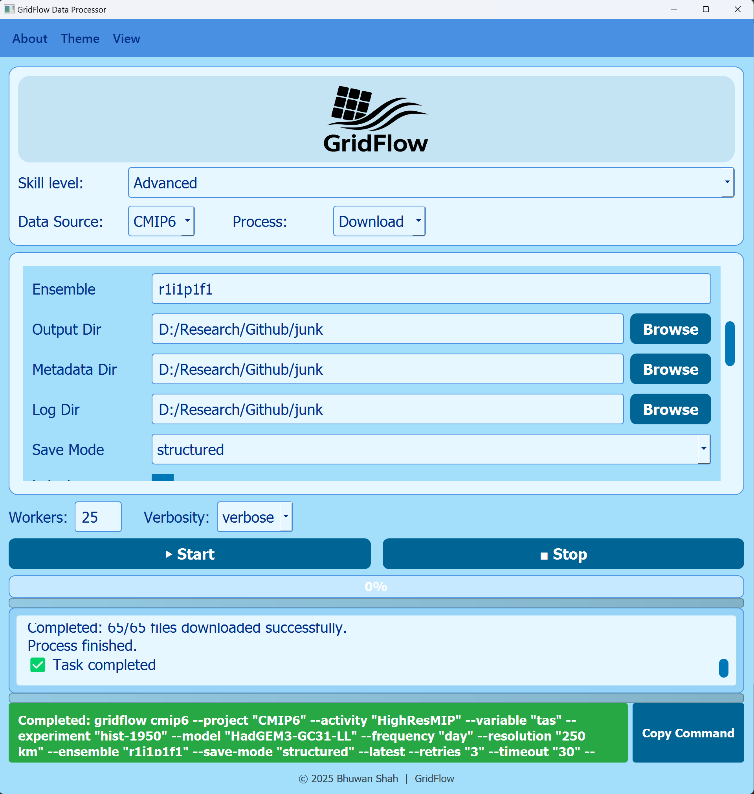
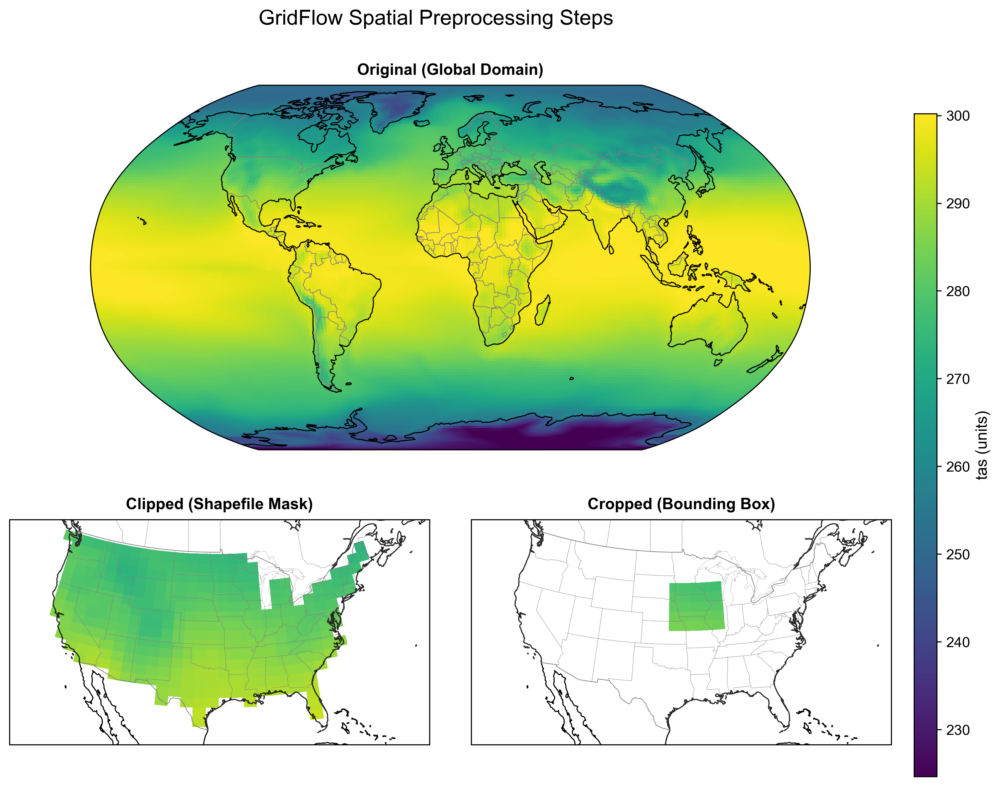
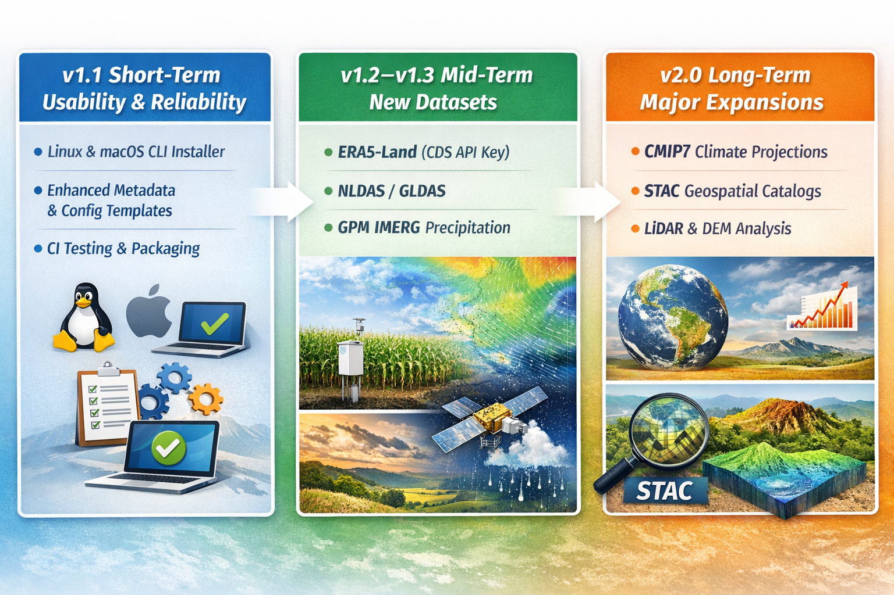

# Summary

Climate and geospatial research increasingly relies on large observational and model-derived datasets such as CMIP6, CMIP5, ERA5 reanalysis, PRISM climate records, and global digital elevation models (DEMs). While these resources are widely available through web portals and distributed archives, acquiring and preparing them for analysis remains a major bottleneck. Researchers frequently spend considerable time navigating search interfaces, handling authentication requirements, writing brittle download scripts, and performing repetitive post-processing steps such as cropping, clipping, unit conversion, and temporal aggregation.

``GridFlow`` is an open-source Python based toolkit that streamlines the complete workflow of climate and geospatial data preparation. It provides both a command-line interface (CLI) and a graphical user interface (GUI) to download major climate products and to process NetCDF datasets into analysis-ready subsets. GridFlow emphasizes modular design, parallel execution, and usability to support a broad user community, including researchers, students, and practitioners who need reliable access to large datasets without extensive custom scripting.

GridFlow is designed to be accessible to a wide range of users through both a GUI (Figure 1) and a command-line interface (Figure 2), enabling users to reproducibly download and process climate and geospatial datasets without the need for custom scripts.

# Statement of need

Despite the continued growth of publicly available climate archives, data acquisition and processing remain disproportionately time-consuming compared to downstream analysis. For example, Earth System Grid Federation (ESGF) portals supporting CMIP5/CMIP6 provide powerful search tools, but workflows often involve repeated manual filtering, pagination, and batch downloads. Similarly, reanalysis data systems can impose account setup, API keys, or queue-based access patterns that complicate reproducible retrieval.

In many applied workflows (e.g., hydrology, water resources, agriculture, and land-surface modeling), users require climate variables for specific regions, watersheds, or administrative boundaries and often need derived temporal summaries (e.g., monthly means, seasonal sums). These tasks are commonly addressed through ad-hoc scripts using general-purpose scientific Python tools such as Xarray [@xarray] and GeoPandas [@geopandas]. However, implementing robust pipelines across multiple datasets and formats can create barriers to entry for new users and reduce reproducibility across projects.

GridFlow addresses this gap by offering a single, consistent interface for acquiring and preparing multiple widely used climate and geospatial datasets. The toolkit couples high-level download modules with post-processing utilities to produce analysis-ready NetCDF outputs and metadata summaries, enabling rapid adoption in research and educational contexts.

# Functionality and design

GridFlow is designed as a modular toolkit with two primary capability groups: (1) data downloading modules and (2) processing modules.

## Downloading modules

GridFlow provides dedicated download modules for:

- **CMIP6 climate model data** via ESGF search and retrieval
- **CMIP5 climate model data** via ESGF search and retrieval
- **ERA5 reanalysis data** accessed directly from cloud-hosted sources
- **PRISM historical climate datasets** for the contiguous United States
- **Digital Elevation Models (DEM)** including global (Copernicus) and US-focused DEM products

Users interact with these modules using consistent CLI patterns, while GridFlow manages file organization, logging, metadata generation, and parallel retrieval. Download operations can be configured via command-line options or JSON configuration files to support reproducible workflows.

## Processing modules

GridFlow also includes post-processing utilities for common climate-data preparation tasks:

- **Spatial subsetting**
  - Cropping NetCDF datasets to a latitude/longitude bounding box
  - Clipping datasets using irregular polygons defined by shapefiles
- **Temporal aggregation**
  - Aggregation from daily to monthly, seasonal, or annual frequency using multiple methods
- **Unit conversion**
  - Converting common climate variable units (e.g., Kelvin to Celsius)
- **Catalog generation**
  - Scanning NetCDF directories and producing a JSON catalog of dataset metadata for inventorying
    large multi-model libraries

Figure 3 demonstrates a typical workflow in which users download global or continental-scale NetCDF datasets and then spatially subset the files to a target watershed or region using cropping or clipping.

These operations are frequently required in climate impact studies, watershed-based modeling, and regional climate analyses, and GridFlow provides standardized implementations to reduce boilerplate and ensure consistent outputs.

# Related work

GridFlow addresses a recurring challenge in climate and geospatial workflows: while many high-value datasets are publicly available, the end-to-end process of discovering, downloading, organizing, and preparing them for analysis remains fragmented across portals, archive-specific clients, and custom scripts. Users often combine multiple utilities for data acquisition (e.g., web portals or API clients) with separate tools for preprocessing (e.g., cropping, clipping, aggregation), which can reduce reproducibility and increase maintenance effort.

GridFlow complements downstream climate analytics libraries such as xclim [@xclim] and xCDAT [@xcdat], which focus on derived indicators and analysis once data are already available locally or in a cloud-native format. In contrast, GridFlow focuses on the upstream bottleneck: scalable acquisition and standardized preprocessing of large gridded datasets. By providing consistent commands for both downloading and processing, GridFlow helps users move from raw archives to analysis-ready outputs without assembling a bespoke pipeline for each data source.

Several ecosystem tools support accessing climate archives through cloud-native workflows and metadata catalogs, including Pangeo-based stacks and dataset indexing approaches. For example, intake-esm [@intake-esm] enables discovery and loading of CMIP-style collections through structured catalogs, and xarray-based tooling enables flexible analysis once datasets are opened. These approaches are powerful, but they typically assume that users already operate within specific cloud or catalog ecosystems and do not aim to provide a unified, user-facing pipeline for bulk downloading and local preparation across heterogeneous sources.

GridFlow also relates to interactive GIS software such as QGIS, which offers extensive raster and vector processing capabilities through graphical workflows. While effective for exploratory analysis, desktop GIS tools are not designed for automated large-scale processing across many NetCDF files, nor do they provide an integrated mechanism for consistently retrieving datasets from multiple climate and geospatial repositories. GridFlow differs by offering both a CLI and GUI that expose equivalent configuration options and consistent logging, enabling workflows to be repeated and shared as version-controlled commands.

Overall, GridFlow contributes a modular and extensible “downloader hub” that integrates acquisition and preprocessing for climate and geospatial datasets under a single interface. Its design supports both global-scale datasets and subset-based workflows, enabling reproducible preparation pipelines for research, education, and operational prototyping while reducing the need for archive-specific scripts and manual portal interactions.

# Roadmap and future development

GridFlow is actively being expanded toward a general-purpose “downloader hub” for climate and geospatial datasets, where new sources can be added as independent modules while preserving a consistent user experience. Planned future releases will prioritize additional datasets, improved cross-platform packaging, and expanded preprocessing support. Figure 4 outlines a tentative development roadmap; timelines are subject to change depending on community feedback, available compute resources, and potential funding or sponsorship.

# Availability

GridFlow (version 1.0) is released under the GNU Affero General Public License v3.0 (AGPLv3) and is available on GitHub at:

https://github.com/shahbhuwan/GridFlow

# Acknowledgements

The authors thank the open-source scientific Python community for foundational libraries that enable GridFlow's functionality, including Xarray, GeoPandas, and the broader NetCDF and geospatial ecosystem. The authors also acknowledge the data providers and maintainers of ESGF, PRISM Climate Group, ECMWF (ERA5), Copernicus DEM, and USGS datasets for making large-scale climate and geospatial resources publicly accessible.

This work was supported by the U.S. Department of Agriculture (USDA) Natural Resources Conservation Service (NRCS) under Cooperative Agreement No. NR243A750008C001.